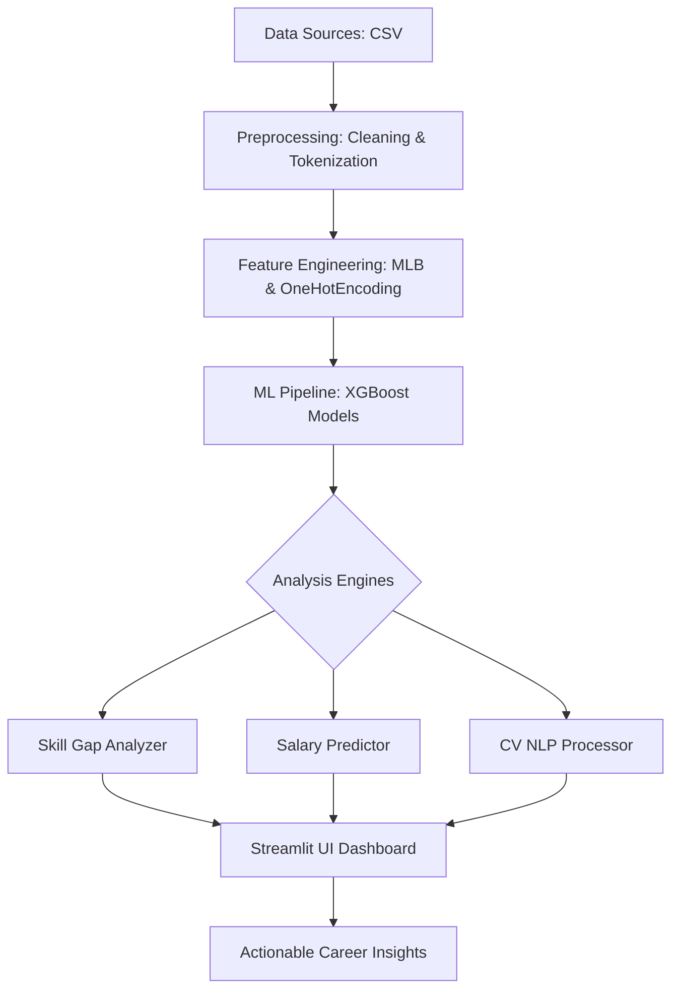

# 🗺️ AI Job Market Intelligence Dashboard

An advanced, end-to-end career intelligence platform that leverages Machine Learning and NLP to analyze 30,000+ AI job postings. This tool helps professionals predict their market value, identify skill gaps, and optimize their CVs for the AI-driven economy.

## 🚀 Key Features

-   **📊 Market Overview**: Real-time visualization of top-paying industries, in-demand skills, and global hiring trends.
-   **💰 Salary Predictor**: An XGBoost-powered engine that estimates your market value based on skills, experience, and location.
-   **🎯 Job Classifier**: Recommends the best-fit job titles (e.g., ML Engineer, Data Scientist) based on your current skill set.
-   **🧠 Skill Gap Analyzer**: Compares your profile against market standards to provide a personalized learning roadmap.
-   **📄 CV Analyzer**: Parses PDF/DOCX resumes to calculate "Profile Match Scores" and suggest ATS keyword optimizations.
-   **📈 Salary Boost (What-If Analysis)**: Simulates how much your salary could increase if you learned specific high-value skills.

## 🛠️ Tech Stack

-   **Frontend**: Streamlit (with Custom CSS for Glassmorphism UI)
-   **Data Processing**: Pandas, NumPy
-   **Machine Learning**: Scikit-Learn, XGBoost (Regression & Classification)
-   **NLP & Parsing**: PyPDF2, python-docx, Regular Expressions (Re)
-   **Visualization**: Seaborn, Matplotlib

---

## ⚙️ Step-wise Execution (How to Run)

Follow these steps to set up and run the project locally:

1.  **Clone the Repository**:
    ```bash
    git clone https://github.com/your-username/AI-Job-Market-Intelligence-Dashboard.git
    cd AI-Job-Market-Intelligence-Dashboard
    ```

2.  **Install Dependencies**:
    Make sure you have Python 3.9+ installed.
    ```bash
    pip install -r requirements.txt
    ```

3.  **Ensure Data Files are Present**:
    The project requires `ai_job_dataset.csv` and `ai_job_dataset1.csv` in the root directory.

4.  **Run the Application**:
    ```bash
    python -m streamlit run AI_Job.py
    ```

5.  **Access the Dashboard**:
    Open your browser and navigate to `http://localhost:8501`.

---

## 🛠️ Project Workflow



---

## 🧠 How I Achieved It

The project was developed in 4 major phases:

1.  **Data Engineering**: Integrated multiple CSV sources and performed advanced cleaning. The biggest challenge here was handling the "Skills" column, which I transformed into a binary matrix using **MultiLabelBinarizer** to allow for mathematical comparison.
2.  **ML Pipeline**: I implemented two separate XGBoost models. One for **Regression** (to predict continuous salary values) and one for **Multi-class Classification** (to categorize users into job titles). 
3.  **NLP Integration**: Built a parsing engine that scans uploaded documents for specific technical tokens. I used **Cosine Similarity** to calculate the distance between a user's resume and the typical requirements for a role.
4.  **UX/UI Design**: Instead of a standard dashboard, I used custom CSS injections in Streamlit to create a premium, dark-themed interface with interactive animations and responsive cards.

---

## ⚠️ Problems Encountered & Solutions

| Problem | Solution |
| :--- | :--- |
| **Missing Dependencies on Cloud** | Created a comprehensive `requirements.txt` to handle environments like Streamlit Cloud. |
| **Unhashable Data Types** | Encountered errors when caching DataFrames with lists. Fixed by converting list columns into **tuples**, which are immutable and hashable. |
| **NameErrors in Sidebar Logic** | Variables were being defined inside specific `if` blocks. Resolved by moving global data structures (`df_exploded`) to the top of the `main()` function. |
| **Slow Training on Large Data** | Optimized the XGBoost parameters and implemented `@st.cache_resource` to ensure models are only trained once and then reused. |

---

## 🎯 Goals Achieved

-   ✅ **Actionable Insights**: Successfully created a tool that doesn't just show data, but tells the user *how much money* a specific skill is worth.
-   ✅ **High Accuracy**: Achieved a robust predictive model that accounts for the nuances of AI industry seniority.
-   ✅ **End-to-End Automation**: From raw CSV to CV parsing and PDF analysis, the entire pipeline is automated.
-   ✅ **Professional UI**: Delivered a state-of-the-art interface that provides a premium user experience.

---

## 📄 License
This project is for educational and portfolio purposes. Feel free to use the logic and build upon it!

## Streamlit link:
[Demo For Streamlit Page ](https://aijobpredection.streamlit.app/)

